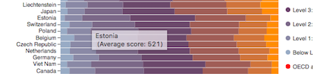
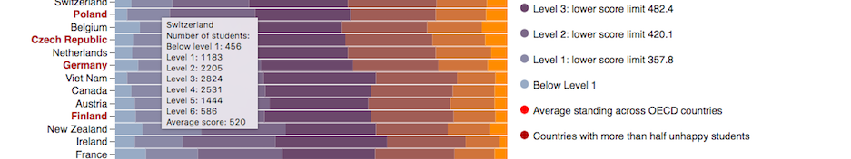

### Udacity / Data Analyst Nanodegree 11'2016
### P6: Data Visualization and D3.js

#### DESCRIPTION: 

For the final project, the goal is to create a data visualization from a data set that tells a story or allows a reader to explore trends or patterns. The work should be a reflection of the theory and practice of data visualization, and it must use either dimple.js or d3.js.

#### TO USE:

Clone project or download project's zip folder to your computer.
Open index.html file in your browser. 
Please note: Do not run python file to parse the original data. It is not provided, since the size is 2.75GB. It can be found [here](https://www.oecd.org/pisa/pisaproducts/pisa2012database-downloadabledata.htm)

#### DATA EXPLORATION:

OECD Program for International Student Assessment (PISA) is a triennial international survey which aims to evaluate education systems worldwide by testing the skills and knowledge of 15-year-old students. Around 510,000 students completed the assessment in 2012, representing about 28 million 15-year-olds in the schools of the 65 participating countries and economies.With mathematics as its primary focus, the PISA 2012 assessment measured student capacity to reason mathematically and use mathematical concepts, procedures, facts and tools to describe, explain and predict phenomena. The PISA assessment also included questions about students’ engagement, drive and self-beliefs. Students were asked to agree or disagree with the statement: 'I feel happy at school'.

#### DATA SOURCE: http://www.oecd.org/pisa/
#### DATA LICENSE: http://www.oecd.org/pisa/47307726.pdf

#### EXPLANATORY ANALYSIS:

'Are Mathematically Proficient Students Less Happy?' visualizes student performance in mathematics and happiness in school. Happiness was calculated based on the proportion of students who agreed with the statement 'I feel happy at school'. Countries were ranked based on the average math scores. ' 

The results show a possible correlation between mathematical standing and students’ reported happiness, with …% of countries above the average and …% of countries below the average marked as unhappy. The graph does not reveal possible causes for this effect, which may include long hours spent at school, a highly competitive environment, high expectations or pressure to succeed from parents, teachers, society and in general.  Moreover, it may be the case that school work has nothing to do with it and some countries are more likely to report happiness in general. 

#### DESIGN:

For my visualization project I chose the horizontal 100% stacked bar chart. In my opinion it is the best, since the purpose of my visualization is to show how a larger category is divided into smaller categories and what the relationship of each part has on the total amount. 100% stack bar graphs show the percentage of the whole of each group and are plotted by the percentage of each value to the total amount in each group. This makes it easier to see the relative differences between quantities in values for each country.

One major flaw of stacked bar graphs is that they become harder to read the more segments each bar has. Also comparing each segment to each other is difficult, as they're not aligned on a common baseline. The purpose of the visualization was to show the general trend of education and standing of each country.

Countries are ranked in descending order of the average test score. The colors of the segment show the percentage of students in each group based on the grade they received. I grouped the grades as per standard levels provided by PISA documentation. It can be found [here](http://www.oecd.org/pisa/aboutpisa/PISA%20scales%20for%20pisa-based%20test%20for%20schools.pdf)

For my findings of the countries with more 'happy' or 'unhappy' students, I decided to separate the data into 2 groups, combining 'strongly agree' with 'agree' and ‘disagree' with 'strongly disagree' into one accordingly. Countries where more than 50% of students reported being unhappy are marked in red. 

The blue line denotes the average mathematical standing across OECD countries. 

The bar chart tooltip shows percentage of students at each level of mathematics proficiency along with the average score. The tooltip of country name tiks provide the happiness score for each country.

### FEEDBACK:

Here is a link to my original post to the [forum:](http://bl.ocks.org/daivaSts/raw/599aeae23dec71047bf0b1f000b4150a/)

**OECD average score**

Mikhail liked the overall work, and commented on the average score:  “The only thing that's not 100% clear is the OECD average score. Is this the average of all countries? And the red line indicates how the countries' average scores relate to overall average? Maybe it should be phrased slightly differently in the legend?”

He was absolutely correct to point that out. I changed the wording to more specific description. It is not a score, the line showed where the average score would stand in the lineup of all countries.

**Fair data?**

My husband Marius’ concern was that the chart includes countries and economies. For example: China (Shanghai), Chinese Taipei, Macao-China, also Perm (Russian Federation) and Russian Federation. His point was that it is not fair to some countries, which might also have regions with possible better education levels. After the verification of the legal status of these regions, I have decided to combine the data and show as one country data point.

**Information on mouseover event**

My friend Asta suggested to change information which appears on mouseover event. Originally it revealed an average score of the country. 

She pointed out that more interesting information would be the numbers encoded in the colors of the segments. I expanded the text box and added number of students per each level, along with the average score. 

**The size of the chart**

Also, Asta’s concern was that the chart is larger than the screen size at the actual size. It is not possible to see the entire chart at the actual size without scrolling. I was considering to flip the chart and make it vertical bar chart, but this layout would make difficult to read the country names. Another choice was to reduce the font size and the bar height, but that would probably would make the chart difficult to read. So I left the layout as is. 

#### RESOURCES:

https://d3js.org/
http://dimplejs.org/examples_viewer.html?id=bars_horizontal_stacked_100pct
http://bl.ocks.org/WilliamQLiu/76ae20060e19bf42d774
http://paletton.com/#uid=1000u0kllllaFw0g0qFqFg0w0aF
http://stackoverflow.com/questions/17933565/inline-style-stroke-width-for-axis-makes-bold-tick-labels
http://www.coolinfographics.com/blog/2014/1/17/where-in-the-world-are-the-best-schools-and-the-happiest-kid.html
http://koaning.s3-website-us-west-2.amazonaws.com/html/d3format.html
